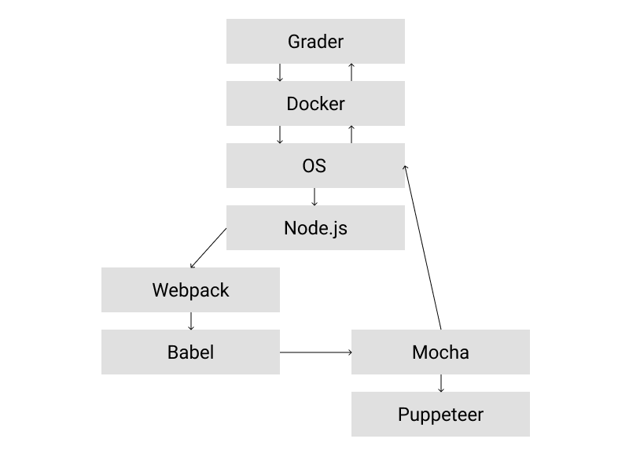

### @size[1em](РАЗРАБОТКА ДВИЖКА ДЛЯ АВТОМАТИЧЕСКОЙ ПРОВЕРКИ КОРРЕКТНОСТИ РЕШЕНИЙ СТУДЕНТОВ НА ЯЗЫКЕ JAVASCRIPT)
 
@div[names]
  
Научный руководитель: Ермакова Г.М.

  
Исполнитель: Неволин Р.Д.

@divend

---

#### Постановка задачи
 
Требования к проверяющей системе:
@ul[small-size]
* Автоматизированность;
* Поддержка исполнения кода в браузере и вне его;
* Возможность запуска unit и end-to-end тестов;
* Расширяемость;
* Выполнение требований безопасности;
@ulend

---

#### Цель работы
 
Цели работы:
@ul[small-size]
* Исследовать иструменты сборки, тестирования и автоматизации JavaScript-приложений;
* Разработать движок автоматической проверки решений студентов на языке JavaScript;
@ulend

---

#### Архитектура платформы Ulearn
 
@div[image]

@divend
---

#### Архитектура движка проверки
 
@div[image]

@divend
