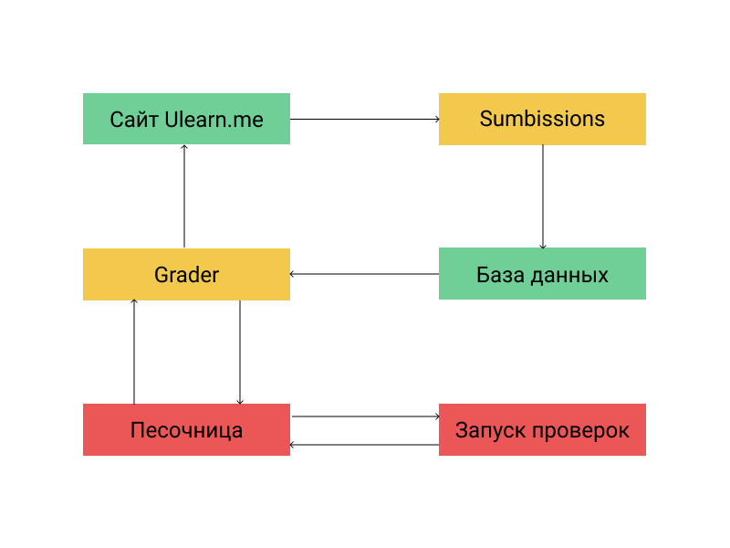

### @size[1em](РАЗРАБОТКА ДВИЖКА ДЛЯ АВТОМАТИЧЕСКОЙ ПРОВЕРКИ КОРРЕКТНОСТИ РЕШЕНИЙ СТУДЕНТОВ НА ЯЗЫКЕ JAVASCRIPT)
 
@div[names]
  
Научный руководитель: Ермакова Г.М.

  
Исполнитель: Неволин Р.Д.

@divend

---

#### Постановка задачи
 
Требования к проверяющей системе:
@ul[small-size]
* Автоматизированность;
* Поддержка исполнения кода в браузере и вне его;
* Возможность запуска unit и end-to-end тестов;
* Выполнение требований безопасности;
* Расширяемость;
@ulend

---

#### Цель работы
 
Цели работы:
@ul[small-size]
* Исследовать иструменты сборки, тестирования и автоматизации JavaScript-приложений;
* Разработать движок автоматической проверки решений студентов на языке JavaScript;
@ulend

---

#### Архитектура платформы Ulearn
 
@div[image]

@divend
---

#### Архитектура движка проверки
 
@div[image]

@divend

---

#### Docker
 
Средство контейнеризации и изоляции  
Использует **namespaces** и **cgroups**

---

#### Node.js
 
Runtime окружения для JavaScipt  
Основан на движке **V8**

---

#### Webpack
 
Инструмент для сборки и автоматизации запуска сценариев  
Запускает следующие процессы:
@ul[small-size]
* Транспиляцая с помощью **Babel**;
* Сборка .js и .css файлов в единый bundle;
* Запуск тестов;
@ulend

---

#### Babel
 
Инструмент для транспиляции JavaScript кода  
Позволяет:
@ul[small-size]
* Трансформировать код для запуска в **браузере** или в **Node.js**;
* Использовать полифилы для недостающих конструкций языка;
@ulend

---

#### Mocha
 
Инструмент для запуска тестов  
Используется для:
@ul[small-size]
* Запуска unit тестов;
* Запуска end-to-end тестов с помощью **Pupperteer**;
@ulend

---

#### Puppeteer
 
Библиотека для работы с браузером  
Основана на браузере **Chromium** и встроеном в него **Webdirver API**

---

#### Возникнувшие трудности
 
В ходе работы возникли следующие трудности:  
@ul[small-size]
* Запуск Docker-образа в OS Windows;
* Запуск Chromium в OS Alpine внутри Docker-образа;
* Отсуствие необходимого Mocha репортера;
* Баги в Babel и Webpack;
@ulend

---

#### Результаты
 
В ходе проделанной работы были получены следующие результаты:  
@ul[small-size]
* Проведен анализ сущестующей архитектуры платформы Ulearn;
* Проведено исследование иструментов сборки, тестирования и автоматизации JavaScript-приложений;
* Разработан движок автоматической проверки решений студентов на языке JavaScript;
* Подготовлена база для дальнейшего развития движка и платформы в целом;
@ulend
---

### Спасибо за внимание
